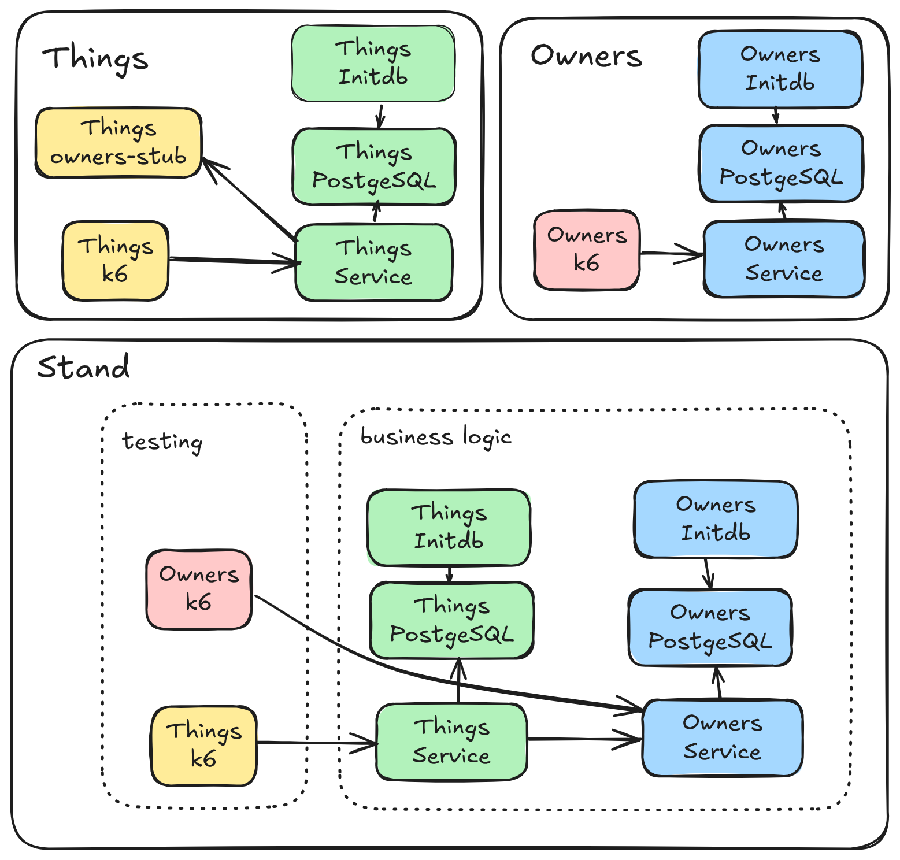
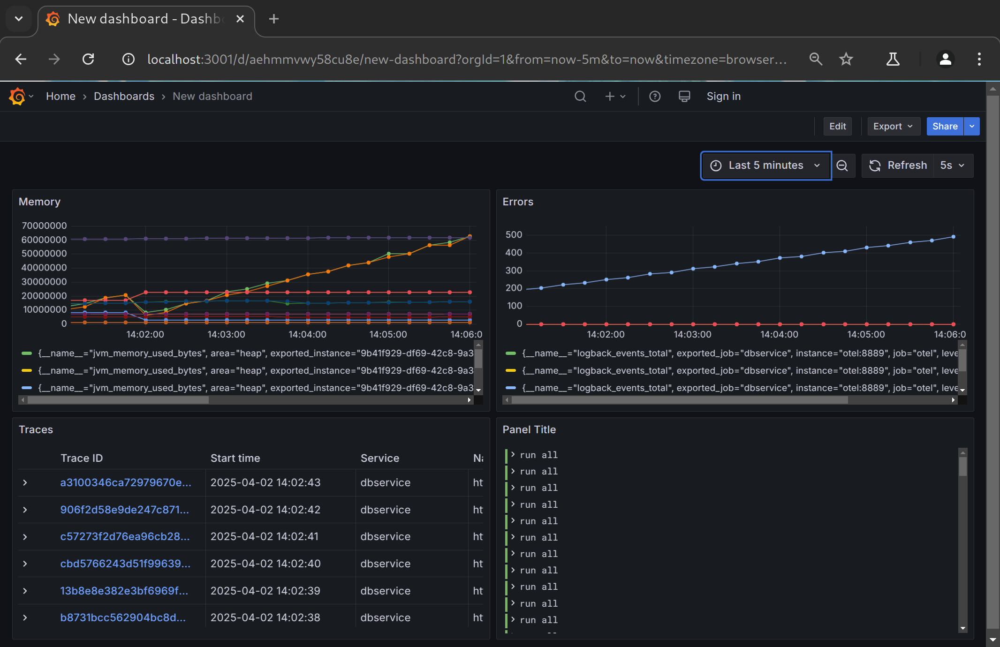
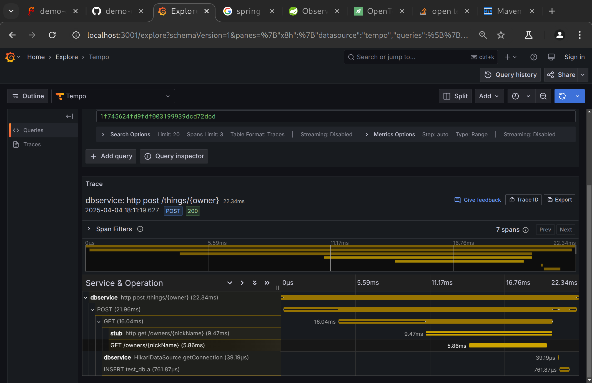

# Demo Two Services with DB and Flyway



Grafana Dashboard





## To do

- observability
  - [x] use prometheus for metrics
  - [x] use loki for logs
  - [x] use tempo for traces
  - [x] use otlp-collector as bridge
  - [x] use grafana for ui
  - [ ] use alertmanager for alerts :-)

- [ ] linters
    - [ ] shellcheck
    - [ ] hadolint
 
- [ ] versioning
  - use /api/vX/ for all endpoints

- [ ] add pitest

- [ ] documentation
  - architecture

- [ ] create second service (owners)   

## Build

```sh
cd things
./mk.sh
docker compose up
xdg-open http://localhost:8087
```

## Pages

 - http://localhost:55679/debug/tracez


## See also

- https://vorozco.com/blog/2024/2024-11-18-A-practical-guide-spring-boot-open-telemetry.html
- https://ridakaddir.com/blog/post/java-observability-using-opentelemetry-tempo-and-loki
- https://www.dmosk.ru/miniinstruktions.php?mini=prometheus-stack-docker
